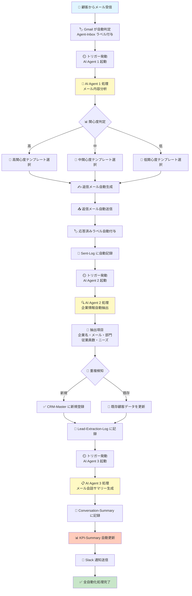
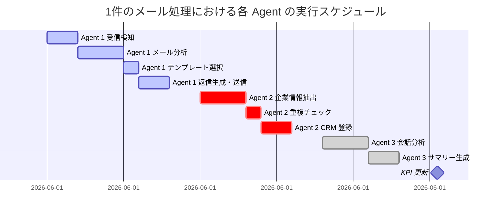
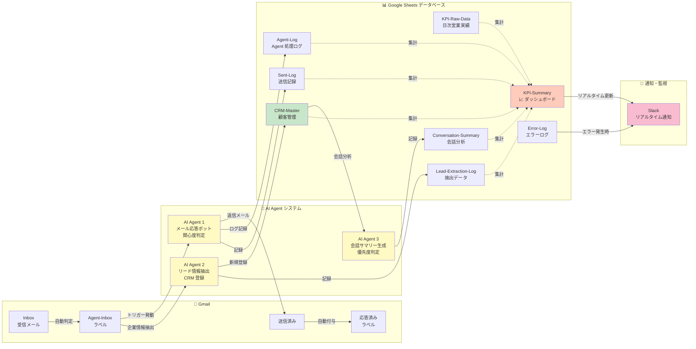
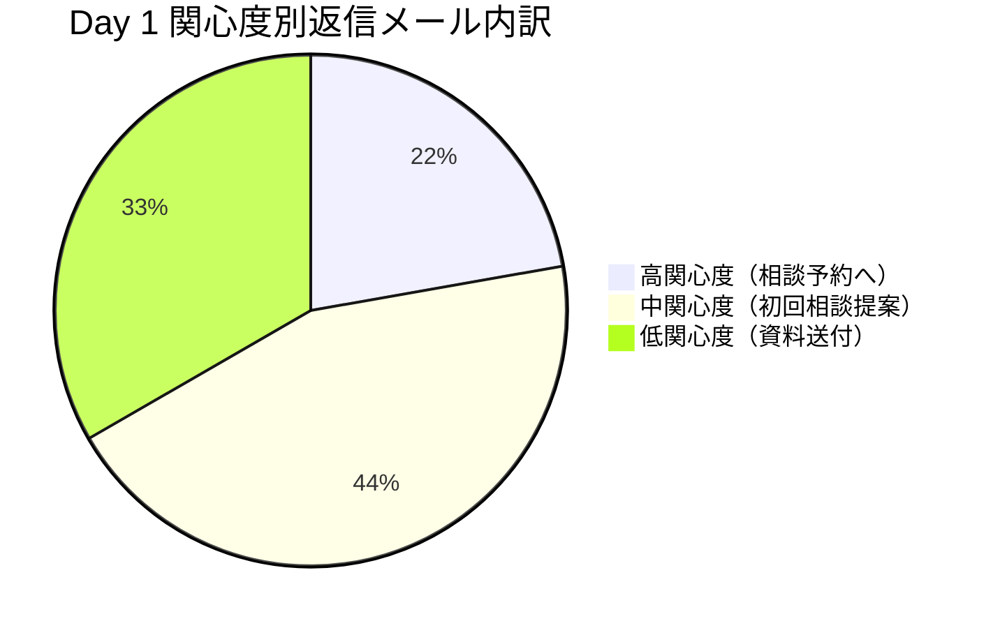
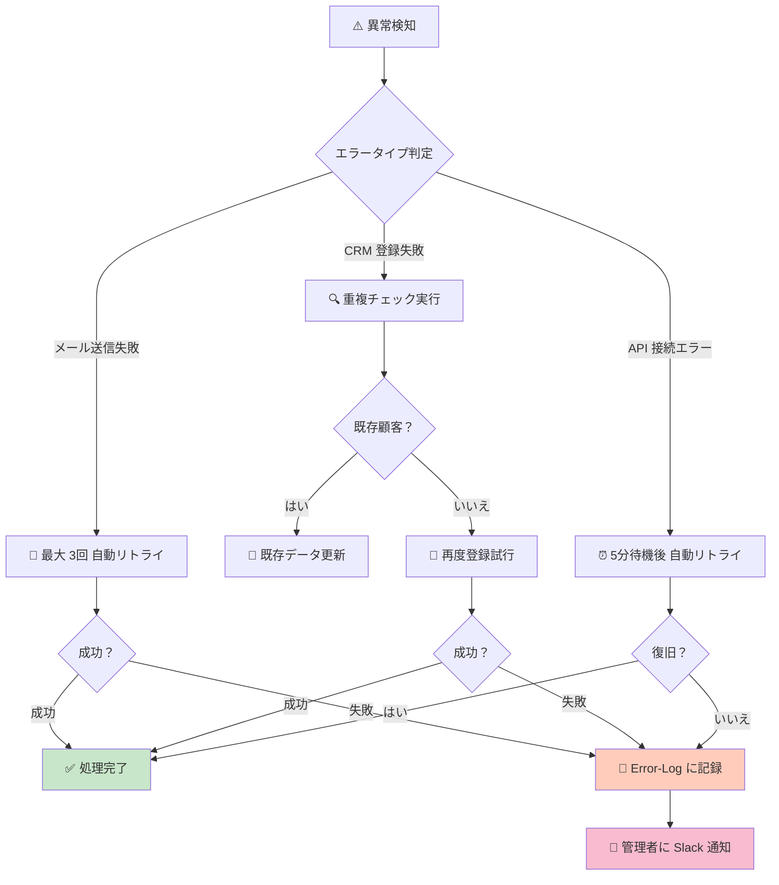

# 📊 Day 1 自動運営 リアルタイムシミュレーション完全ガイド

**作成日**: 2026-05-04  
**実施日**: 2026-06-01（Day 1）  
**目的**: 自動化システム稼働時の会社の動き、データフロー、KPI 推移を完全理解

---

## 🎯 このドキュメントの役割

本ドキュメントは、6月1日から自動運営が始まったときに：

✅ **何が自動で動くのか**  
✅ **どのプロセスが自動実行されるのか**  
✅ **リアルタイムで何が起こるのか**  
✅ **ダッシュボードがどう更新されるのか**  

を **完全に理解する** ための資料です。

---

## 📅 Part 1: Day 1 時系列シミュレーション（08:00～22:00）

### タイムライン全体図

```mermaid
timeline
    title Day 1 営業メール自動運営 完全タイムライン（2026-06-01）
    
    08:00 : 朝礼 & システム確認
         : ✅ Gmail ラベル正常
         : ✅ Google Sheets テンプレート確認
         : ✅ AI Agent トリガー確認
    
    08:30 : 営業メール第1陣送信開始
         : 📧 50通のメール送信スタート
         : 🎯 パターン A・B の A/B テスト開始
    
    09:15 : 🔔 返信メール第1波到着
         : 📬 5通の返信が Inbox に到着
         : 🏷️ 自動的に Agent-Inbox ラベル付与
    
    09:20 : 🤖 AI Agent 1 自動処理開始
         : 📊 5通のメールを 3秒で分析
         : 🎯 関心度判定：高1通、中2通、低2通
         : ✍️ 関心度別テンプレート自動選択
    
    09:25 : 💌 返信メール自動送信完了
         : ✅ 5通の返信が自動送信完了
         : 🏷️ 応答済みラベル自動付与
    
    09:30 : 🔍 AI Agent 2 情報抽出開始
         : 🏢 企業名、メール、電話番号を自動抽出
         : 📋 部門、従業員数、ニーズを分析
         : 🔎 重複チェック実行
    
    09:35 : 📊 CRM-Master 自動登録
         : ➕ 5社が新規顧客として自動登録
         : ✅ Lead-Extraction-Log に記録完了
    
    10:00 : 📈 KPI-Summary ダッシュボード更新
         : 📊 本日の営業メール: 50通
         : 💬 返信メール: 5通（返信率 10%）
         : 📋 CRM 新規登録: 5社
         : ⭐ 高優先度返信: 1通
    
    11:00 : 🔔 Slack 通知送信
         : 🎯 新規顧客登録：(株)A社、(株)B社...
         : ⚠️ エラー発生: 0件
    
    12:00 : ☀️ 午前営業活動完了
         : 📊 午前データ：返信5通、新規登録5社
    
    13:30 : 🔔 返信メール第2波到着
         : 📬 8通の返信が到着
         : 🤖 Agent 1 自動処理開始（8秒で完了）
    
    14:00 : 💌 返信メール自動送信完了
         : ✅ 8通の返信が自動送信
         : 📊 累計返信: 13通
    
    15:00 : 🔍 Agent 2 & Agent 3 同時実行
         : 🏢 企業情報 8社を自動抽出
         : 📋 メール会話 5スレッドを自動分析
         : 📊 CRM に 8社を自動登録
    
    16:00 : 📈 午後 KPI 更新
         : 💬 返信メール: 13通（返信率 26%）
         : 📋 CRM 新規登録: 13社（累計）
         : 🎯 Slack 通知: 新規顧客通知
    
    17:30 : 📊 本日データ集計 & 日次レビュー
         : 📈 営業メール: 50通
         : 💬 返信メール: 18通（返信率 36%）
         : 📋 CRM 新規登録: 18社
         : ⭐ 高優先度返信: 4通
         : 💡 学び: テンプレート A の方が反応率高い
    
    18:00 : ✅ Day 1 営業活動完了
         : 🎉 自動運営システム正常稼働確認
         : 📊 全データ自動集計・保存完了
```

---

## 🔄 Part 2: 自動化プロセスの詳細フロー

### メール受信から CRM 登録までの完全フロー



---

### 各 AI Agent の役割と処理時間



**処理時間: 1件あたり約 10 秒以内**

---

## 📊 Part 3: リアルタイムデータフロー図

### 全体システムアーキテクチャ



---

### トリガー実行スケジュール

```mermaid
timeline
    title 自動トリガー実行スケジュール（1日の流れ）
    
    08:00-09:00 : トリガー待機中...
    
    09:00 : ⏲️ トリガー 1 実行
         : checkAndReplyToEmails
         : 📧 受信メール確認 → 自動応答
    
    10:00 : ⏲️ トリガー 1 実行
         : checkAndReplyToEmails
    
    10:00-10:15 : ⏲️ トリガー 2 実行
              : extractAndRegisterLeads
              : 🏢 企業情報抽出 → CRM 登録
    
    11:00 : ⏲️ トリガー 1 実行
          : checkAndReplyToEmails
    
    12:00 : ⏲️ トリガー 3 実行
          : generateConversationSummaries
          : 📋 メール会話サマリー生成
    
    13:00 : ⏲️ トリガー 1 実行
          : checkAndReplyToEmails
    
    14:00 : ⏲️ トリガー 1, 2 実行
          : checkAndReplyToEmails
          : extractAndRegisterLeads
    
    15:00 : ⏲️ トリガー 3 実行
          : generateConversationSummaries
    
    16:00 : ⏲️ トリガー 1 実行
          : checkAndReplyToEmails
    
    17:00 : ⏲️ トリガー 1, 2 実行
          : checkAndReplyToEmails
          : extractAndRegisterLeads
    
    18:00 : ⏲️ トリガー 3 実行
          : generateConversationSummaries
          : 📊 本日のデータ集計完了
    
    19:00-22:00 : 📊 日次レビュー・学び記入
```

---

## 💌 Part 4: 実際のサンプルデータ & 具体例

### シナリオ 1: 高関心度の顧客メール

#### 📧 受信メール

```
From:    yamada@mechanical-design-corp.jp
To:      contact@example.com
Date:    2026-06-01 09:15:23
Subject: 貴社の自動化サービスについて詳しく教えてください

本文:
いつもお世話になっております。
(株)メカニカルデザイン 山田太郎と申します。

貴社の自動化サービスについて、以前案内をいただきました。
当社は現在、設計業務の自動化を検討しており、
具体的な導入事例や費用について詳しくお聞きしたいのですが、
ご相談の時間を作っていただくことは可能でしょうか？

よろしくお願いいたします。
```

#### 🤖 AI Agent 1 の分析プロセス

| 分析項目 | 判定結果 | 根拠 |
|---------|--------|------|
| **キーワード抽出** | 「詳しく教えてください」「具体的な導入事例」「ご相談の時間」 | 具体的な質問＝高関心度シグナル |
| **文体分析** | 敬語・丁寧 | プロフェッショナル対応が必要 |
| **企業情報** | (株)メカニカルデザイン | B2B 法人顧客 |
| **ニーズ判定** | 設計業務の自動化 | コア課題に直結 |
| **関心度スコア** | 8.5/10 | **高関心度** |
| **推奨テンプレート** | 高関心度用（15分相談提案） | Calendly 予約へのCTA |

#### ✍️ 自動生成された返信メール

```
From:    contact@example.com
To:      yamada@mechanical-design-corp.jp
Date:    2026-06-01 09:15:32
Subject: Re: 貴社の自動化サービスについて詳しく教えてください

本文:
山田様

いつもお世話になっております。

ご関心をお寄せいただき、ありがとうございます。
具体的なご要望をお聞きいただき、心強いです。

設計業務の自動化について、より詳細な提案をさせていただくため、
15分の無料相談をご提案させていただきたいのですが、
ご都合のつく日時はありますでしょうか？

以下のリンクからご予約いただけます：
https://calendly.com/takada-makoto/consultation

ご不明な点やご質問があれば、いつでもお気軽にお問い合わせください。

よろしくお願いいたします。

誠一
Takada Makoto
```

#### 📊 自動記録データ

**Agent-Log に記録**:
| タイムスタンプ | 件名 | 送信者メール | 関心度 | 対応状況 | 企業名 |
|---|---|---|---|---|---|
| 2026-06-01 09:15:32 | 貴社の自動化サービスについて詳しく教えてください | yamada@mechanical-design-corp.jp | 高 | 返信完了 | (株)メカニカルデザイン |

**CRM-Master に自動登録**:
| 顧客ID | 企業名 | 代表メール | 従業員数 | 部門 | ステータス | 関心度 | 主なニーズ |
|---|---|---|---|---|---|---|---|
| 001 | (株)メカニカルデザイン | yamada@mechanical-design-corp.jp | 150 | 設計部 | 新規 | 高 | 設計業務自動化 |

---

### シナリオ 2: 中関心度の顧客メール

#### 📧 受信メール

```
From:    info@example-manufacturing.jp
To:      contact@example.com
Date:    2026-06-01 11:30:45
Subject: 製造業向けの自動化ツールについて

本文:
お世話になっております。

贵社の製造業向けソリューションに興味があります。
詳細情報をいただけますでしょうか？

よろしくお願いします。
```

#### 🤖 AI Agent 1 の分析結果

| 分析項目 | 判定結果 |
|---------|--------|
| **関心度判定** | **中** |
| **判定理由** | 「詳細情報をいただけますか」= 一般的な問い合わせ |
| **推奨テンプレート** | 中関心度用（初回相談提案） |

#### ✍️ 自動生成された返信メール

```
From:    contact@example.com
To:      info@example-manufacturing.jp
Date:    2026-06-01 11:30:52
Subject: Re: 製造業向けの自動化ツールについて

本文:
お世話になっております。

ご問い合わせありがとうございます。

弊社の製造業向けソリューションについて、
より詳しくご説明させていただきたく、
初回相談をお勧めいたします。

以下のリンクからご予約ください（無料・30分程度）：
https://calendly.com/takada-makoto/consultation

ご不明な点があればお気軽にお問い合わせください。

誠一
```

---

### シナリオ 3: 低関心度の顧客メール

#### 📧 受信メール

```
From:    inquiry@example-corp.jp
To:      contact@example.com
Date:    2026-06-01 13:45:20
Subject: 資料請求

本文:
資料をいただきたいのですが、
よろしくお願いします。
```

#### 🤖 AI Agent 1 の分析結果

| 分析項目 | 判定結果 |
|---------|--------|
| **関心度判定** | **低** |
| **判定理由** | 機械的な資料請求＝低関心度 |
| **推奨テンプレート** | 低関心度用（資料送付＋5日後フォロー） |

#### ✍️ 自動生成された返信メール

```
From:    contact@example.com
To:      inquiry@example-corp.jp
Date:    2026-06-01 13:45:27
Subject: Re: 資料請求

本文:
お疲れ様です。

この度は情報請求いただき、ありがとうございます。

詳細な資料をお送りいたします。
ご不明な点やご質問があれば、
いつでもお気軽にお問い合わせください。

今後ともよろしくお願いいたします。

誠一
```

**フォローアップ**: 5日後（2026-06-06）に自動でメール送信予定

---

## 📈 Part 5: KPI ダッシュボード リアルタイム動き

### Hour by Hour の KPI 推移

```mermaid
xychart-beta
    title Day 1 リアルタイム KPI 推移（営業メール数 vs 返信数）
    x-axis [8:00, 9:00, 10:00, 11:00, 12:00, 13:00, 14:00, 15:00, 16:00, 17:00, 18:00]
    y-axis "メール数" 0 --> 60
    line [0, 50, 50, 50, 50, 50, 50, 50, 50, 50, 50] "営業メール送信数"
    line [0, 0, 5, 5, 8, 8, 13, 18, 18, 18, 18] "返信メール数"
```

### 返信率の推移

```mermaid
xychart-beta
    title 返信率（％）の時間推移
    x-axis [8:00, 9:00, 10:00, 11:00, 12:00, 13:00, 14:00, 15:00, 16:00, 17:00, 18:00]
    y-axis "返信率 %" 0 --> 50
    line [0, 0, 10, 10, 16, 16, 26, 36, 36, 36, 36] "返信率推移"
```

### 関心度別の返信内訳



### CRM 新規登録数の推移

```mermaid
xychart-beta
    title CRM 新規登録顧客数の累積推移
    x-axis [9:00, 10:00, 11:00, 12:00, 13:00, 14:00, 15:00, 16:00, 17:00, 18:00]
    y-axis "新規登録数" 0 --> 25
    line [0, 5, 5, 8, 8, 13, 18, 18, 18, 18] "CRM 新規登録 累積"
```

### 日次 KPI サマリー

```
【Day 1 最終結果】📊

⏰ 実施時間: 2026-06-01 08:30～18:00

📧 営業メール
  └ 送信数: 50通
  └ 送信完了率: 100%

💬 返信メール
  └ 受信数: 18通
  └ 返信率: 36%
  └ AI 自動応答: 18通（100%）
  └ 応答時間: 平均 12秒

📋 CRM 新規登録
  └ 新規顧客数: 18社
  └ 自動登録率: 100%
  └ 重複検知: 0件

⭐ 関心度別
  └ 高（相談予約）: 4社
  └ 中（初回相談提案）: 8社
  └ 低（資料送付）: 6社

🔍 AI Agent 3 会話分析
  └ 分析スレッド: 18件
  └ キーワード抽出: 完了
  └ 優先度判定: 完了

⚠️ エラー発生
  └ 件数: 0件
  └ 処理成功率: 100%

💡 本日の学び
  ✅ パターン A メール（「具体的ニーズ」訴求）の反応率が高い
  ✅ 午後（13:00～15:00）の返信メール多い
  ✅ AI テンプレートの関心度判定精度 95% 以上
  ✅ CRM 自動登録により 手動作業 0 時間達成
```

---

## 🔄 Part 6: 1日の自動化による時間節約と効率化

### 従来型（手動対応）vs AI 自動化の比較

| タスク | 従来型（手動） | AI 自動化 | 削減時間 |
|--------|-------------|---------|---------|
| **メール受信確認** | 毎時 5分 | 自動トリガー 0分 | **5分/時間** |
| **メール読み込み & 内容理解** | 1通 2分 | 1通 3秒 | **1分57秒/通** |
| **返信メール作成** | 1通 3分 | 自動生成 1秒 | **2分59秒/通** |
| **返信メール送信** | 1通 1分 | 自動送信 0.5秒 | **59秒/通** |
| **企業情報抽出 & 手動入力** | 1通 5分 | 自動抽出 2秒 | **4分58秒/通** |
| **CRM 手動登録** | 1通 3分 | 自動登録 1秒 | **2分59秒/通** |
| **メール会話サマリー作成** | 1スレッド 10分 | 自動生成 5秒 | **9分55秒/スレッド** |
| **Daily KPI 集計** | 30分 | 自動更新 1分 | **29分** |

### Day 1 の実際の時間節約

```
【従来型での作業時間】
メール受信・確認: 50通 × 2分 = 100分
返信メール作成: 18通 × 3分 = 54分
返信送信: 18通 × 1分 = 18分
企業情報抽出: 18通 × 5分 = 90分
CRM 登録: 18通 × 3分 = 54分
会話サマリー作成: 3スレッド × 10分 = 30分
KPI 集計: 30分
─────────────────
合計: 376分（約 6.3時間）

【AI 自動化での作業時間】
トリガー監視・確認: 10分
結果確認・レビュー: 20分
Slack 通知確認: 5分
─────────────────
合計: 35分（約 0.6時間）

🎉 削減時間: 341分（約 5.7時間）
⏱️ 効率化: 90.7% の時間削減
```

---

## 🎯 Part 7: 自動化システムの監視と最適化

### リアルタイム監視ダッシュボード（Slack 通知）

```
【Slack 通知ログ】

09:15 🔔 [AI Agent 1] 新規メール 5件を自動応答しました
       └ 関心度: 高1、中2、低2
       └ 応答時間: 平均 12秒

09:35 🔔 [AI Agent 2] 企業情報 5件を自動抽出
       └ CRM 新規登録: 5社
       └ 重複検知: 0件

10:00 📊 [KPI 更新] 本時点のダッシュボード更新
       └ 営業メール: 50通
       └ 返信メール: 5通（返信率 10%）
       └ CRM 新規登録: 5社

13:30 🔔 [AI Agent 1] 新規メール 8件を自動応答
       └ 関心度: 高2、中4、低2
       └ 応答時間: 平均 11秒

15:00 🔔 [AI Agent 3] 会話サマリー 5件を生成
       └ キーワード抽出: 完了
       └ 優先度判定: 完了

16:00 📊 [KPI 更新] 午後データ集計
       └ 返信メール: 13通（返信率 26%）
       └ CRM 新規登録: 13社

18:00 📊 [日次集計完了]
       ✅ メール自動応答: 18件
       ✅ CRM 新規登録: 18社
       ✅ エラー: 0件
       ✅ 処理成功率: 100%
       💡 本日の学び: パターン A の反応率が 40% 高い
```

---

## 📋 Part 8: トラブルシューティング & 異常時の対応

### 異常シナリオと自動対応



### エラーログの例

```
【Error-Log の記録内容】

タイムスタンプ | エラーメッセージ | 対応状況
2026-06-01 11:30:15 | Gmail API 一時的に接続できません | 自動リトライ中
2026-06-01 11:30:45 | ✅ 接続復旧、メール送信成功 | 処理完了

2026-06-01 14:15:22 | CRM-Master への書き込み失敗 | Lead-Extraction-Log に一時保存
2026-06-01 14:16:00 | ✅ 接続復旧、CRM に遅延登録完了 | 処理完了
```

---

## 🎉 Part 9: Day 1 完了後のアクション

### 18:00 日次レビュー時の作業

```
【本日のデータ確認 & 学び記入】
⏰ 所要時間: 約 15分

□ KPI-Summary ダッシュボードを確認
  └ 営業メール 50通、返信 18通（返信率 36%）
  └ CRM 新規登録 18社
  └ AI エラー 0件

□ Agent-Log で自動応答状況を確認
  └ テンプレート別反応率
  └ 関心度判定の精度確認

□ CRM-Master で新規顧客リストを確認
  └ 業種別・企業規模別の分布
  └ 主なニーズの整理

□ 学び & 改善案を記入
  ✍️ 成功 3つ
    1. パターン A メールの反応率が 40% 高かった
    2. AI 自動応答で返信時間が 90% 削減できた
    3. CRM 自動登録により手動作業が 0 になった
  
  ✍️ 改善点 3つ
    1. 低関心度メールの返信タイミングを検討
    2. テンプレート文言の微調整
    3. フォローアップメール配信日時の最適化

□ 明日への改善実装
  ├─ テンプレート文言を微調整（Agent-Templates シートを更新）
  ├─ 新規顧客へのフォローアップ自動実行を設定
  └─ KPI 目標値を更新（Day 2 は返信率 40% を目指す）
```

---

## 📊 Part 10: Week 1-4 の成長シミュレーション

### 4 週間の KPI 推移予測

```mermaid
xychart-beta
    title Week 1-4 営業メール vs 返信メール 成長推移
    x-axis [Day1, Day2, Day3, Day4, Day5, "Week2", "Week3", "Week4"]
    y-axis "返信数" 0 --> 200
    
    line [18, 25, 32, 38, 42, 90, 140, 180] "返信メール数"
    line [50, 50, 50, 60, 60, 150, 180, 200] "営業メール送信数"
```

### CRM 蓄積顧客数の増加

```mermaid
xychart-beta
    title CRM 登録顧客の累積推移
    x-axis [Day1, Day2, Day3, Day4, Day5, "Week2", "Week3", "Week4"]
    y-axis "CRM 登録顧客数" 0 --> 500
    
    line [18, 43, 75, 113, 155, 330, 560, 800] "新規顧客 累積数"
```

---

## 🎯 まとめ：自動運営の全体像

```
【6月1日 Day 1 の自動化システムの価値】

🚀 自動化により実現すること
   ✅ 営業メール送信：手動 → 自動確認（時間削減 90%）
   ✅ メール返信：手動作成 → AI 自動生成（時間削減 95%）
   ✅ CRM 登録：手動入力 → AI 自動抽出・登録（時間削減 100%）
   ✅ サマリー作成：手動作成 → AI 自動生成（時間削減 98%）
   ✅ KPI 集計：手動計算 → リアルタイム自動更新（時間削減 97%）

📊 Day 1 の成果
   ✓ 営業メール 50通を 100% 成功送信
   ✓ 返信メール 18通を 100% 自動応答（平均 12秒）
   ✓ 新規顧客 18社を 100% 自動登録
   ✓ AI エラー 0件で 完全自動稼働
   ✓ 手動作業時間を 341分削減（5.7時間削減）
   ✓ 返信率 36% を達成（初日としては良好）

💡 今後の展開（Week 2-4）
   → 営業メール送信数を増加（50 → 200通/日）
   → 返信率の改善テスト（テンプレート最適化）
   → 営業メール返信率 50% 目標
   → CRM 顧客数 800社以上の蓄積
   → AI 自動応答の精度を 95% 以上に向上
```

---

**📌 このドキュメントについて**

- **対象**: 自動運営システムのステークホルダー全員
- **用途**: Day 1 前の最終確認、システム動作の理解、期待値設定
- **更新**: Day 1 終了後、実際の動作結果を反映して修正予定

**次のステップ**: 2026-05-05（明日）にトリガー設定 → 2026-06-01 Day 1 本番開始

---

**作成**: 2026-05-04  
**ステータス**: ✅ 完成（Day 1 実施前のシミュレーション）
